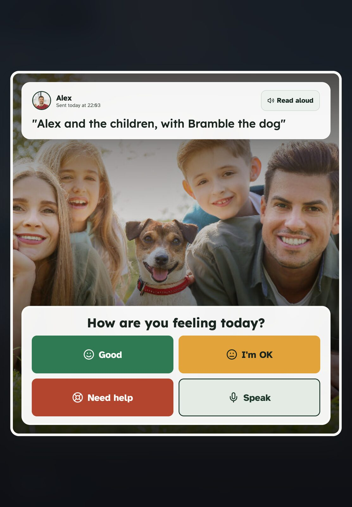
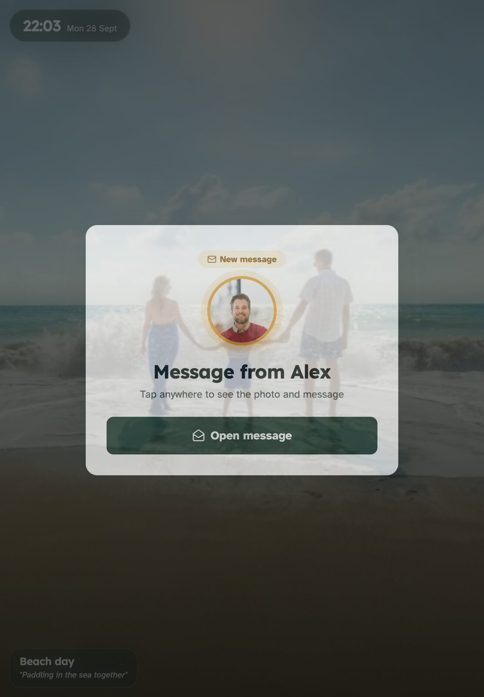
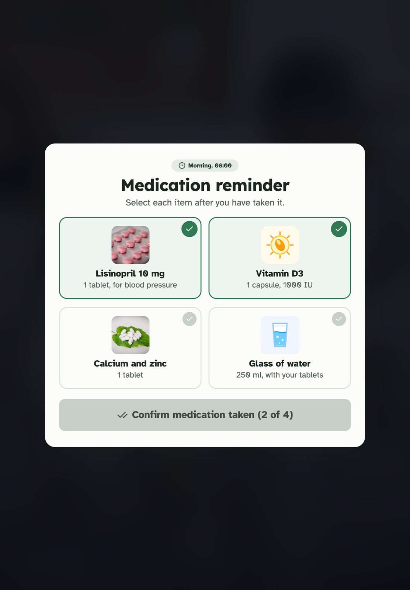
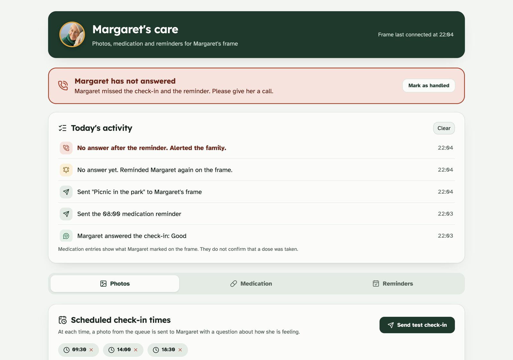

# Care Companion

A tablet for someone who needs care, and a control panel for the family who looks after them. The tablet is a quiet photo frame until the family has something to say. Then it asks a simple question, and if nobody answers, the family finds out.



## What it does

- **Photo check-ins.** The family queues photos with a caption. One becomes today's check-in, the tablet reads it aloud and asks "How are you feeling today?" with big answers: Good, I'm OK, Need help, or speak a reply.
- **Pill reminders.** The tablet shows each pill with a picture. Grandma taps each one, then Done. The family sees it logged.
- **Errands.** A reminder for Grandma plus a named family member who is responsible for it, like a lift to the doctor.
- **Missed check-ins get escalated.** No answer, the tablet reminds her again. Still no answer, the family's panel raises an alert and plays a sound.
- **Activity log.** Every answer, reminder and alert shows up on the family's panel with a time.

| Check-in arrives | Pills | Family panel after a missed check-in |
|---|---|---|
|  |  |  |

## How the reminder engine works

Check-ins, pills and errands all run through the same loop:

1. The family sends or schedules an item.
2. It takes over the tablet with a sound and a spoken prompt.
3. If Grandma opens it, the countdown stops and her answer goes to the family.
4. If she doesn't, the tablet reminds her once more.
5. If there is still no answer, the family panel shows an alert and logs it.

For the demo the retry and the alert fire after 5 seconds each, so the miss path can be shown live.

## Built with

HTML, CSS and JavaScript with no build step. The tablet and the family panel talk to each other through the browser's `BroadcastChannel` and `localStorage`, so both screens stay in sync on one machine. Speech uses the browser's built-in text to speech. Icons are Lucide. Fonts are Lexend and Atkinson Hyperlegible, which was designed for readers with low vision.

There is also a Django, Postgres and Redis backend scaffold in `backend/` with a health check. The demo does not use it yet.

## Run it locally

```bash
git clone https://github.com/itsdakpan/cursor-hackathon-salaya.git
cd cursor-hackathon-salaya/frontend
python3 -m http.server 8000
```

Open http://localhost:8000. The launcher shows the tablet and the family panel side by side. Press **Send as Check-in Now** on a photo in the family panel and watch the tablet. To see the miss path, send one and don't tap anything for 10 seconds.

Use a local server rather than opening the files directly, because the two screens need to share an origin to talk to each other.

To run the backend scaffold: `cd backend && docker compose up`, then visit http://localhost:8001/health/.

## Background

Built in one day at the Cursor hackathon in Salaya, Thailand, on 22 August 2026, by a team that included Yakupov Ayaz, Chris and Dylan Akpan. The team shared one laptop for most of the day, so most of the commits come from a single account. Dylan worked on the idea, the screen designs, the pitch and parts of the front end, and tested and presented the demo.

The original team repo is [AyazYakupov/cursor-hackathon-salaya](https://github.com/AyazYakupov/cursor-hackathon-salaya).

- [Product brief](PRODUCT.md): users, features and what was out of scope
- [Demo script](DEMO.md): the 90 second demo path and fallbacks
- [Design notes](DESIGN.md)
- [Team process](TEAM_PROCESS.md)
- [API contracts](api-contracts/README.md)

After the hackathon, Dylan revamped the frontend:

- A calmer, higher contrast design built for older eyes
- The escalation alert and activity log on the family panel (before, missed check-ins never reached it)
- A visible voice reply button, still tap targets, and a correct picture for every pill
- Resized photo uploads so large pictures fit in browser storage
- Every image and script bundled in the repo, so the demo no longer depends on outside image hosts
